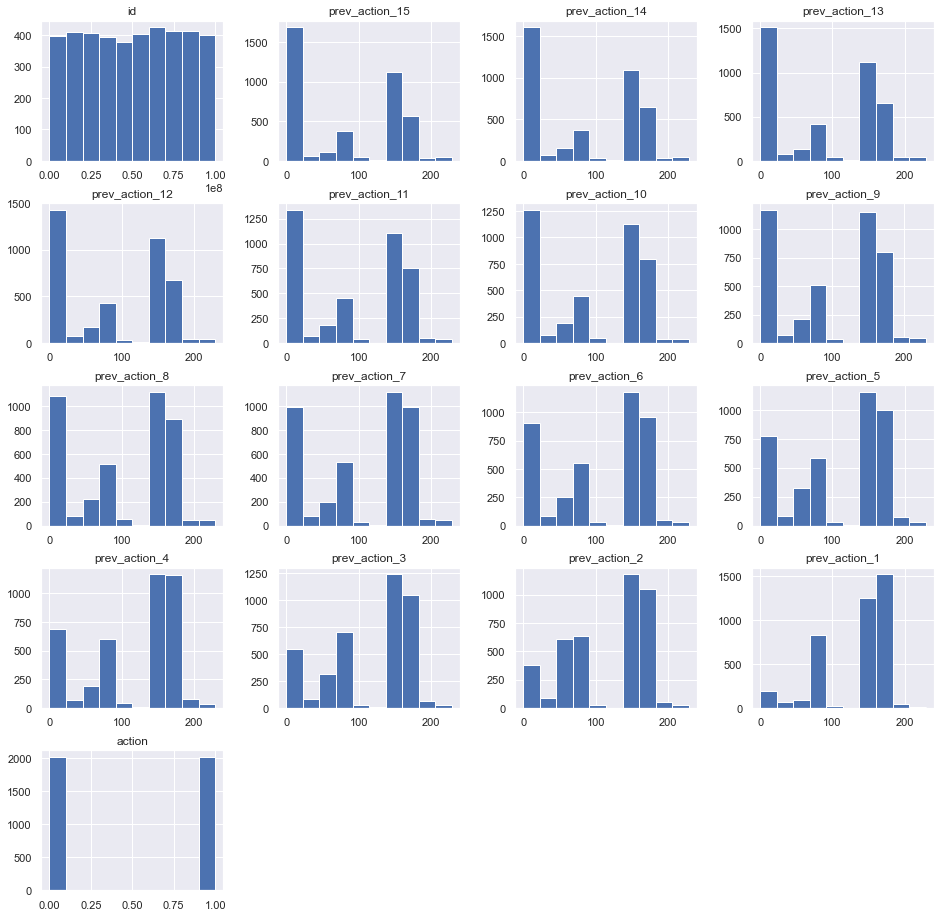
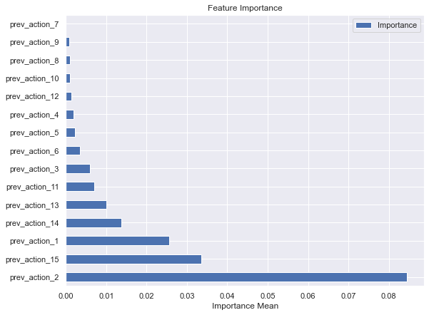
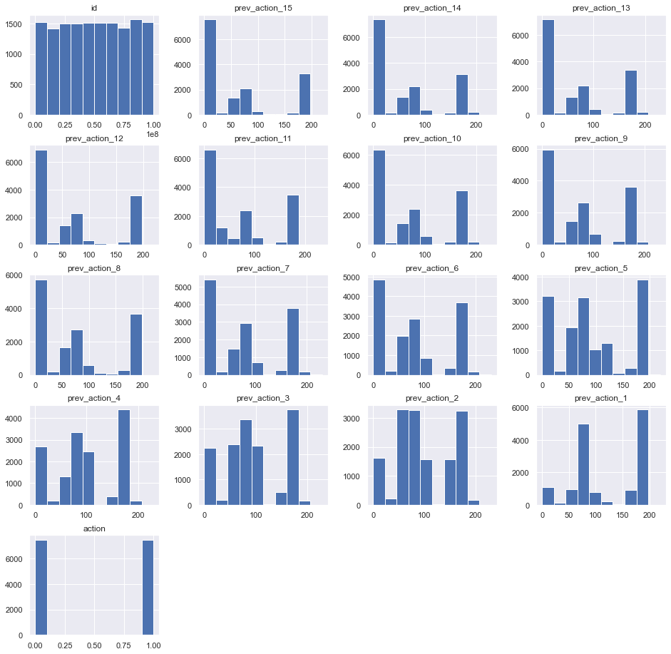
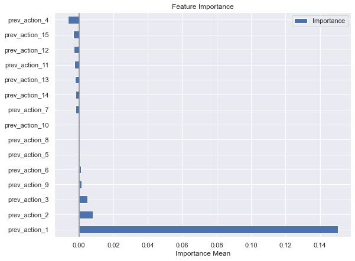
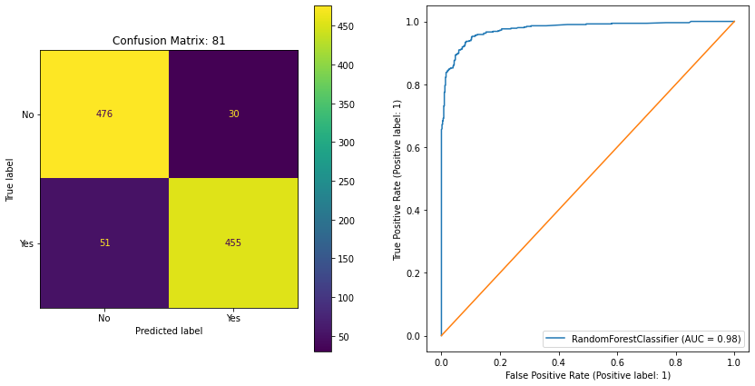
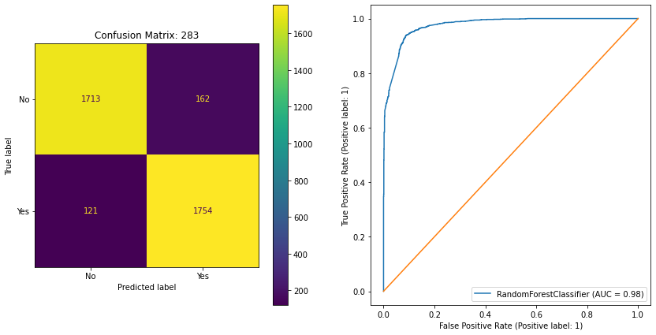

# Customer Interactions

------------

by **Aykan Erdenizmenli**

------------

## Executive Summary

Customer Interactions give insights about journey trail maps which is essential about their behavior to understand if they are on track or not. When customers deviate from the happy path, consequences may be costly which are called negative experiences.

In this Capstone research, data is provided clean, ready-to-use in columnar form containing history (independent variables) and target in single record per customer. 

I am using commercial datasets, therefore, I will not be able to share them publicly!

------------

## Rationale

Customer anomaly detection is a critical step to keep them engaged on the platform as majority of negative experiences result with abandoning the platform altogether, hence _churn_ is a costly operation in customer service segment.

------------

## Research Question

Negative experiences are known and marked in the system, in this research, the focus is to identify 2 negative experiences coded as `55` and `142` in 2 separate datasets.

------------

## Data Sources

The data source is customer interactions in the form of events which are contiously collected after each customer interaction, the datasets are generated from the event commercial data source. 

Each line in the dataset contains a series of 15 previous interactions which are independent variables and a target interaction column which is the dependent variable:
*  A records contains 15 customer interaction data points over past 30 days, even if there is more, the set is restricted to the most recent 15 interactions and the dependent variable.

The datasets are cleaned up and ready-to-use, true nature of interactions are not enclosed, though. There are 2 datasets, one dataset for 55 and one dataset for 142:
*  All features are numeric
*  The data is balanced, there are equal number of target values with 50% distribution.
*  Missing data elements filled with 0s
*  id is a unique identifier per row which bundles interactions together within the row
*  `prev_action_15` 
 through
*  `prev_action_1` columns
    * they contain previous interaction codes, from oldest to newest action code: `prev_action_15` being oldest and `prev_action_1` being most recent in the data model representation
    * If there are not enough data points in client interaction history, 0 will be placed in these previous action columns. Please note, semantically, zeros will start appearing from prev_action_15 (from oldest to newest). 0 cannot be on prev_action_1 which means no entry over 30 days for this client!
*  `action` is the target column either 55 or 142 depedening on the dataset
*  Target variable `action` should be transformed to 0 or 1 for binary classification
*  Sample data below:

|id   |prev_action_15   |prev_action_14   |prev_action_13   |prev_action_12   |prev_action_11   |prev_action_10   |prev_action_9 |prev_action_8 |prev_action_7 |prev_action_6 |prev_action_5 |prev_action_4 |prev_action_3 |prev_action_2 |prev_action_1 |action|
|---|---------------|---------------|---------------|---------------|---------------|---------------|-------------   |--------------|--------------|--------------|--------------|--------------|--------------|--------------|--------------|------|
|19059237|  104|  158|  131|  72|   179|  75|   75|   73|   180|  180|  179|  180|  75|   55|   75|   55|

### Dataset #1:

#### Feature Importance Dataset #1:

### Dataset #2:

#### Feature Importance Dataset #2:

------------

## Methodology

Binary classification techniques are used in the research, `Logistic Regression`, `Decision Tree Classifier` and `Random Forest Classifier` have been tried out to pick best performance.

------------

## Results

The expected result is predicting `action` column in the dataset by utilizing customer history, there are two models per technique to predict action code = `55` and `142` respectively. `Random Forest Classifier` outperformed `Logistic Regression` and `Decision Tree Classifier` mordels significantly.

The model results are shown in the following table from best to worst performer:

|Model |Accuracy|Precision|
|-------|------|-------|
|Random Forest|0.92|0.92|
|Decision Tree|0.90|0.90|
|Logistic Regression|0.76|0.75|

### Random Forest Classifier

   Fine tuned the model by GridSearchCV with the hyperparameters to reduce `false positives`. Ran analysis by `{accuracy: {'criterion': 'entropy', 'max_depth': 20, 'min_samples_leaf': 2, 'min_samples_split': 5, 'random_state': 93} ` hyperparameters which produced:

#### Dataset #1:

#### Dataset #2:

### Next Steps
Those models will highlight negative customer experiences, so, `false positive` rate should be low but skipping detection of negative experience (`false negative`) is also important considering proactive outreach to customers unnecessarily not so desired on false positive cases. So, the model should minimize misclassifications therefore model `accuracy` should be high as well as the `precision`.

The models are binomial currently, in the next phase multinomial models should be tried out to predict negative experiences by a single model and dataset.

Performance would be improved by utilizing boosting or neural network for regression techniques as next steps.

------------

## Outline of Project
The functionalities are separated into Jupyter notebook files to execute these following functions:

1. [data.eda.Aykan.ipynb](./data.eda.Aykan.ipynb) is for exploratory data analysis
2. [LogisticRegression.Aykan.ipynb](./LogisticRegression.Aykan.ipynb) is for executing Logistic Regression model
3. [DecisionTreeClassifier.Aykan.ipynb](./DecisionTreeClassifier.Aykan.ipynb) is for executing Decision Tree Classifier model
4. [RandomForestClassifier.Aykan.ipynb](./RandomForestClassifier.Aykan.ipynb) is for executing Random Forest Classifier model

------------

## Contact and Further Information
e-mail: aykan@yahoo.com

------------